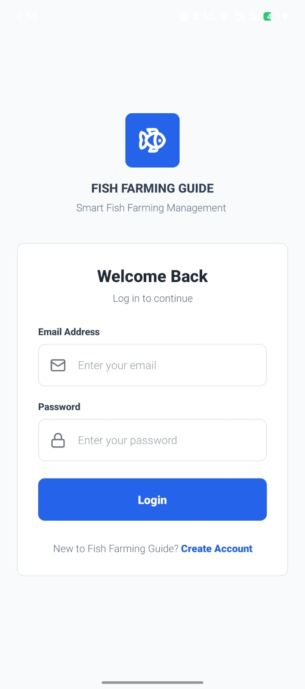
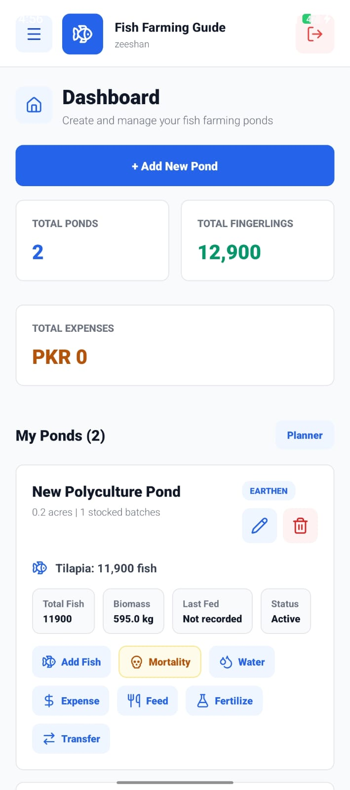
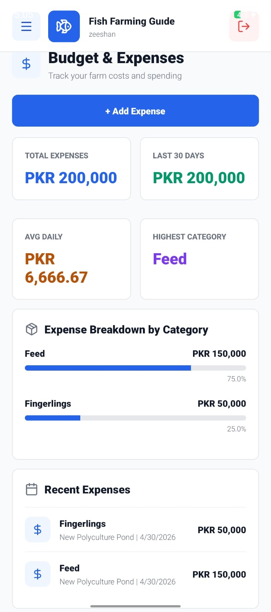
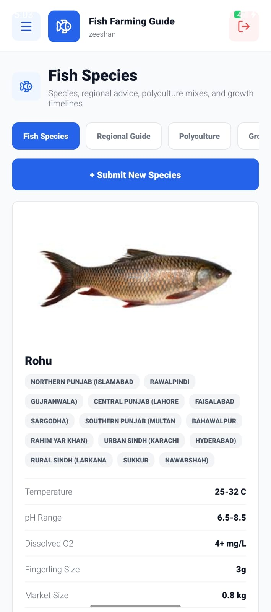

## 🐟 Fish Farming Guide App

> 📱 A real-world mobile app for managing fish farms with data tracking & recommendations.

### 🔗 Quick Links
- Demo Video: (YouTube/Drive link)
- GitHub: (repo link)

### 📊 Highlights
- ✔ Authentication (JWT)
- ✔ CRUD (Feed, Fish, Stock)
- ✔ REST API (Node.js)
- ✔ MySQL Database
- ✔ Clean UI (React Native)

## 📸 App Preview

  
  
  
  

## ⚙️ Tech Stack
React Native | Node.js | MySQL | Express

## 🚀 Installation
... (already good)

## 📂 API Endpoints (VERY IMPORTANT)
| Method | Endpoint | Description |
|-------|--------|------------|
| POST | /api/auth/login | Login user |
| POST | /api/fish | Add fish |
| GET  | /api/fish | Get all fish |
